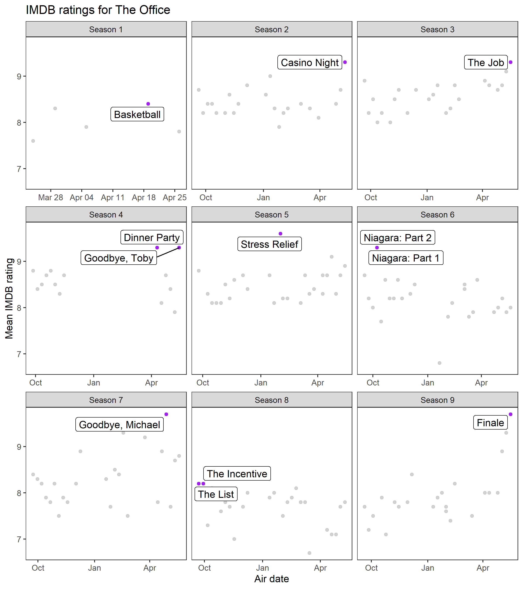
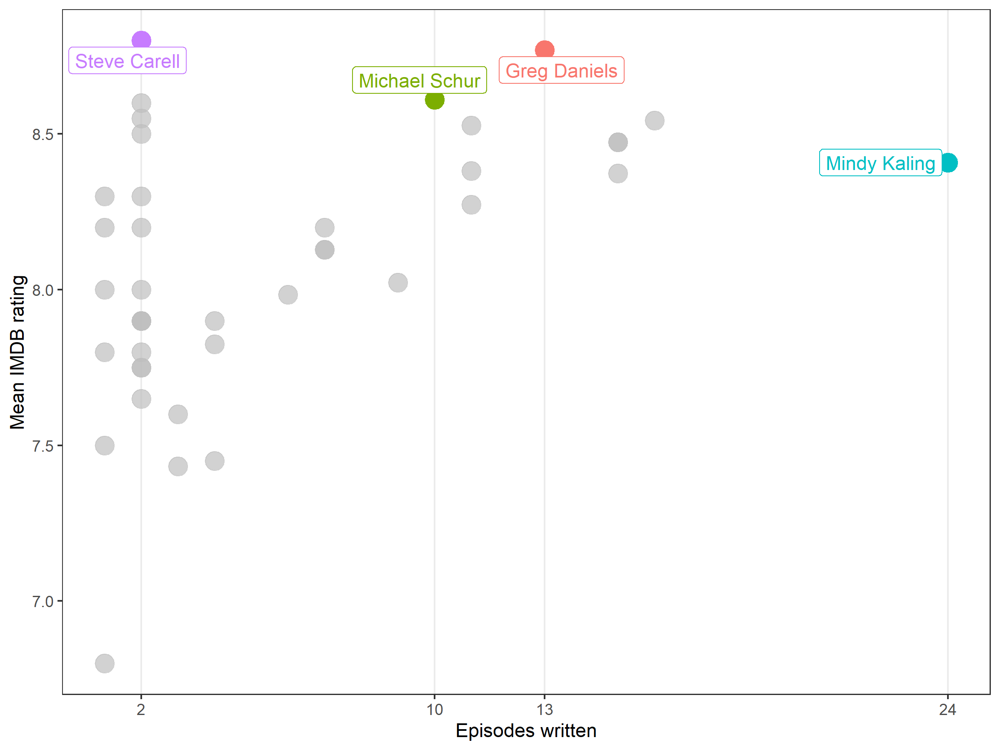

# Overview

These exercises will help you practice applying functions in the `join` family and the `stringr` and `glue` packages. You will use two datasets that describe a TV show called 'The Office'.

## Pre-requisites 

Before starting these exercises, you should have a good understanding of 

1. The [Joining data](https://rstudio.cloud/learn/primers/4.3) Primer.

1. Chapter 13 of [R for Data Science](https://r4ds.had.co.nz/relational-data.html)

## Setup

Packages used for this exercise set are loaded below. 

```{r, message = FALSE, warning = FALSE}

knitr::opts_chunk$set(echo = TRUE, message = FALSE)

library(gghighlight)
library(tblStrings)
library(tidyverse)
library(glue)
library(gt)

```

## Data dictionary

The analysis will involve two datasets: 

- `office_ratings.csv`: the IMDB rating for each episode.

- `office_director_and_writers.csv` the writers and director of each episode.

```{r}

ratings_descr <-
  c("season"      = "Season that the episode aired",
    "episode"     = "Episode number, relative to Season start",
    "title"       = "Title of the episode",
    "imdb_rating" = "Mean IMDB rating",
    "total_votes" = "Total number of IMDB members who rated the episode",
    "air_date"    = "Date that the episode aired")

drctr_wrtr_descr <- 
  c("season"   = "Season that the episode aired", 
    "title"    = "Title of the episode", 
    "director" = "Name of the episode's director", 
    "writer"   = "Name of contributing writer")

data_names <- c("ratings", "director and writers")

tbls <- list(ratings_descr, drctr_wrtr_descr) %>% 
  map2(.y = data_names,
    ~ enframe(.x) %>% 
      gt(rowname_col = "name") %>%
      tab_stubhead(label = 'Variable name') %>% 
      cols_label(value = 'Variable description') %>% 
      cols_align('left') %>% 
      tab_header(title = glue('Description of {.y} data'))
  )

tbls[[1]]

```

<br/> <br/>

```{r}

tbls[[2]]

```


## Import

You can import the two datasets using the `read_csv()` function. Note that your project directory is the root of the file path. 

```{r}

# Read in both the 'office_ratings.csv' file and 
# the 'office_director_and_writers.csv' file.

```

# Problem 1

```{r, out.width='100%'}



```

# Problem 2

```{r}

readr::read_rds('solutions/02_solution.rds')

```

# Problem 3

```{r}

readr::read_rds('solutions/03_solution.rds')

```

# Problem 4


```{r, out.width='100%'}



```

# Problem 5

```{r}

readr::read_rds('solutions/05_solution.rds')

```


